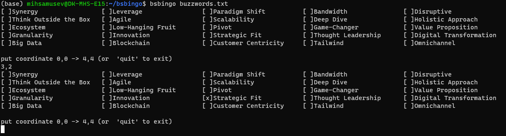

## bsbingo
Play bs bingo with your fellow corpies!

### Install
```bash
pip install git+https://github.com/mihsamusev/bsbingo
```


### Run
Get example data by downloading `buzzwords.txt` manually or with `wget https://raw.githubusercontent.com/mihsamusev/bsbingo/main/buzzwords.txt`

```bash
bsbingo buzzwords.txt
```


